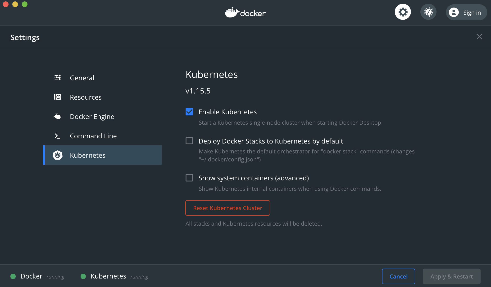
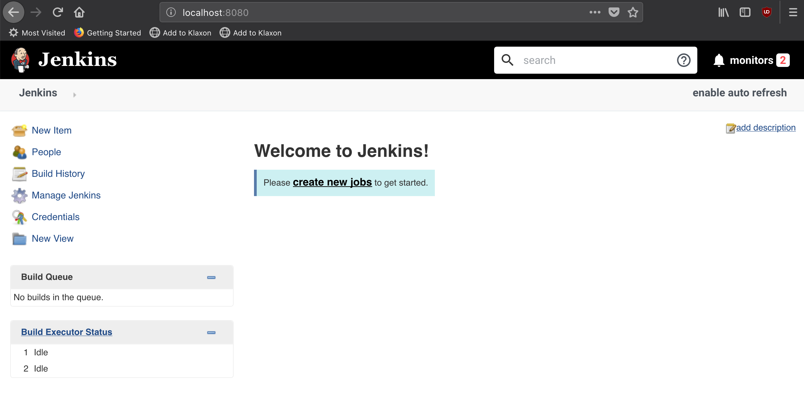

# You Don't Know Jenkins - Part 4 - Kubernetes Slaves

This repository is associated with my blog post detailing how to Dynamically spin up Jenkins slaves on a Kubernetes cluster

- [https://blog.thesparktree.com/you-dont-know-jenkins-part-4](https://blog.thesparktree.com/you-dont-know-jenkins-part-4)

This repository will help you spin up a Kubernetes cluster and Jenkins server locally, so you can follow along with the blog post.

> Note: This repository is meant for use in a lab environment, and will not necessarily work out of the box in a production environment.

# Requirements

You'll need to have [Docker for Mac](https://docs.docker.com/docker-for-mac/install/) or [Docker for Windows](https://docs.docker.com/docker-for-windows/) installed


# Kubernetes Cluster

Docker for Mac/Windows comes with the ability to spin up a miniature Kubernetes cluster (which we can use to follow along with the blog post)
It's pretty easy to enable.

- Go to the Docker for Mac/Windows preferences panel
- Click "Kubernetes" in the left menu
- Ensure the  "Enable Kubernetes" box is checked.
- Click "Apply & Restart"



Once that's complete, you can verify that your Kubernetes cluster is up and running using the following commands:

```bash
$ kubectl config current-context
  docker-desktop

$ kubectl config view
  apiVersion: v1
  clusters:
  - cluster:
      certificate-authority-data: DATA+OMITTED
      server: https://kubernetes.docker.internal:6443
    name: docker-desktop
  contexts:
  - context:
      cluster: docker-desktop
      user: docker-desktop
    name: docker-desktop
  - context:
      cluster: docker-desktop
      user: docker-desktop
    name: docker-for-desktop
  current-context: docker-desktop
  kind: Config
  preferences: {}
  users:
  - name: docker-desktop
    user:
      client-certificate-data: REDACTED
      client-key-data: REDACTED

```

If your output looks similar, you're ready to go.

Your Kubernetes cluster access url will be listed under `clusters[0].cluster.server`.
In my case it's: `https://kubernetes.docker.internal:6443`.
We'll need that url when we follow along with the blog post, so keep it handy.

# Jenkins Server

Next we'll need to setup a Jenkins server for testing. We'll do that via `docker-compose` & the official Docker image for Jenkins.
I've set that all up for you in this repository, so you can just run the following commands:

```bash
git clone git@github.com:AnalogJ/you-dont-know-jenkins-dynamic-kubernetes-slaves.git

docker-compose up
```

At this point, your Jenkins server should be up and running, and accessible via your browser:

Just got to [http://localhost:8080](http://localhost:8080) and you should see the following:




# Done

You now have all the pre-requisites to continue following along with [You Don't Know Jenkins - Part 4 - Kubernetes Slaves](https://blog.thesparktree.com/you-dont-know-jenkins-part-4)
